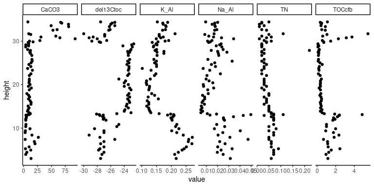

<!-- README.md is generated from README.Rmd. Please edit that file -->

# PAGES

<!-- badges: start -->
<!-- badges: end -->

The package PAGES was designed as supportive material for a webinar
designed for the [PAGES Early-Career Network
(ECN)](http://pastglobalchanges.org/ecn/intro). The goal is to give some
useful pointers to explore geological data, in particular stratigraphic
occurrences, and uses RStudio and packages from the [tidyverse
universe](https://www.tidyverse.org/packages/).

## R for Data Science (R4DS)

This class is completely modelled after Hadley Wickham’s and Garrett
Grolemund’s R4DS. However, I have augmented the examples with cases from
geology.

<div class="figure">


<p class="caption">
Book cover (Wickham and Grolemund 2016)
</p>

</div>

</div>

## Credits

The construction of the R (R Core Team 2021) package *point* and
associated documentation was aided by the packages; *devtools* (Wickham,
Hester, and Chang 2021), *roxygen2* (Wickham, Danenberg, et al. 2020),
*knitr* (Xie 2021, 2014, 2015), *rmarkdown* (Allaire et al. 2021; Xie,
Allaire, and Grolemund 2018; Xie, Dervieux, and Riederer 2020) and the
superb guidance in the book: *R packages: organize, test, document, and
share your code*, by Wickham (2015). In addition, this package relies on
a set of external packages from the tidyverse universe, including:
*dplyr* (Wickham et al. 2021), *tidyr* (Wickham 2021), *tibble* (Müller
and Wickham 2021), *stringr* (Wickham 2019), *readr* (Wickham and Hester
2020), *magrittr* (Bache and Wickham 2020), and *readr* (Wickham and
Hester 2020). Plots are made with *ggplot2* (Wickham, Chang, et al.
2020; Wickham 2016) and *thematic* (Sievert, Schloerke, and Cheng 2021)
is used for a consistent design in the presentation.

## Installation

You can install the released version of PAGES from
[github](https://github.io) with:

``` r
# Install PAGES from GitHub:
# install.packages("devtools")
devtools::install_github("MartinSchobben/PAGES")
```

## Usage

Load PAGES with `library`.

``` r
library(PAGES)
```

## Data sources

The study on the Triassic–Jurassic (\~201 Million years before present)
boundary section of Bonenburg (Germany) and Kuhjoch (Austria) by
Schobben et al. (2019) is used as the example material for this course.
Lazy load datasets constitute:

\-`kuhjoch` - Kuchjoch is a palynological dataset where the counts have
summed for spores, pollen, aquatic and terrestrial elements.  
-`bonenburg` - Bonenburg is a geochemical dataset containing: elemental
analyser total organic carbon (TOC) and total nitrogen (TN), XRF element
data; Aluminium (Al), Potassium (K) and sodium (Na), as well as the
carbon isotope composition of TOC (del13Ctoc).

Raw datasets (`kuhjoch_raw.csv` and `bonenburg_raw.csv`) can be easily
accessed with the `PAGES_example()` function and a call to the `readr`
function `read_csv()`.

``` r
readr::read_csv(PAGES_example("kuhjoch_raw.csv"))
```

## Render presentation slides

To render the presentation slides:

``` r
render_slides()
```

## Exercizes

Details regarding the exercizes and live programming during the webinar
can be found under the package vignettes (called with `vignette()`).

-   RStudio projects: `vignette("project", package = "PAGES")`
-   Exploratory data analysis: `vignette("explore", package = "PAGES")`
-   Patterns and models: `vignette("model", package = "PAGES")`
-   Load, tidy and transform data:
    `vignette("wrangle", package = "PAGES")`

## Tidy format

The lazy load datasets are provided in a tidy format. Look-up directory
`data-raw` for details on the data processing.

``` r
head(bonenburg)
#> # A tibble: 6 x 11
#>   Section Strat Strat2 SampleID Height CaCO3    TN del13Ctoc TOCcfb  Na_Al  K_Al
#>   <chr>   <chr> <chr>     <dbl>  <dbl> <dbl> <dbl>     <dbl>  <dbl>  <dbl> <dbl>
#> 1 Bonenb… Cont… Pre-e…        0   3.01 13.3   0.06     -27.5   1.16 0.0314 0.216
#> 2 Bonenb… Cont… Pre-e…      100   3.95  3.84  0.07     -27.3   0.96 0.0250 0.211
#> 3 Bonenb… Cont… Pre-e…      150   4.43  5.86  0.07     -27     1.25 0.0197 0.224
#> 4 Bonenb… Cont… Pre-e…      200   4.94 12.8   0.07     -27.8   1.52 0.0231 0.236
#> 5 Bonenb… Cont… Pre-e…      250   5.25  3.34  0.09     -27.6   2.45 0.0330 0.243
#> 6 Bonenb… Cont… Pre-e…      275   5.68  9.91  0.06     -27     1.19 0.0201 0.251
```

Besides wide format data the similarly named datasets with the suffix
`_long` are used to generate, for example, multi-proxy stratigraphic
plost for initial data exploraiton.

``` r
ggplot(data = bonenburg_long) +
  geom_point(mapping = aes(x = value, y = Height)) +
  facet_grid(cols = vars(measurement), scales = "free_x") +
  theme_classic()
```

<!-- -->

# References

<div id="refs" class="references csl-bib-body hanging-indent">

<div id="ref-rmarkdown" class="csl-entry">

Allaire, JJ, Yihui Xie, Jonathan McPherson, Javier Luraschi, Kevin
Ushey, Aron Atkins, Hadley Wickham, Joe Cheng, Winston Chang, and
Richard Iannone. 2021. *Rmarkdown: Dynamic Documents for r*.
<https://CRAN.R-project.org/package=rmarkdown>.

</div>

<div id="ref-magrittr" class="csl-entry">

Bache, Stefan Milton, and Hadley Wickham. 2020. *Magrittr: A
Forward-Pipe Operator for r*.
<https://CRAN.R-project.org/package=magrittr>.

</div>

<div id="ref-tibble" class="csl-entry">

Müller, Kirill, and Hadley Wickham. 2021. *Tibble: Simple Data Frames*.
<https://CRAN.R-project.org/package=tibble>.

</div>

<div id="ref-rversion" class="csl-entry">

R Core Team. 2021. *R: A Language and Environment for Statistical
Computing*. Vienna, Austria: R Foundation for Statistical Computing.
<https://www.R-project.org/>.

</div>

<div id="ref-Schobben2019" class="csl-entry">

Schobben, Martin, Julia Gravendyck, Franziska Mangels, Ulrich Struck,
Robert Bussert, Wolfram M. Kürschner, Dieter Korn, P. Martin Sander, and
Martin Aberhan. 2019. “<span class="nocase">A comparative study of total
organic carbon-*δ*13C signatures in the Triassic–Jurassic transitional
beds of the Central European Basin and western Tethys shelf
seas</span>.” *Newsletters on Stratigraphy* 52 (4): 461–86.
<https://doi.org/10.1127/nos/2019/0499>.

</div>

<div id="ref-thematic" class="csl-entry">

Sievert, Carson, Barret Schloerke, and Joe Cheng. 2021. *Thematic:
Unified and Automatic Theming of Ggplot2, Lattice, and Base r Graphics*.
<https://CRAN.R-project.org/package=thematic>.

</div>

<div id="ref-Wickham2015" class="csl-entry">

Wickham, Hadley. 2015. *R Packages: Organize, Test, Document, and Share
Your Code*. O’Reilly Media, Inc. <https://r-pkgs.org/>.

</div>

<div id="ref-ggplot22016" class="csl-entry">

———. 2016. *Ggplot2: Elegant Graphics for Data Analysis*.
Springer-Verlag New York. <https://ggplot2.tidyverse.org>.

</div>

<div id="ref-stringr" class="csl-entry">

———. 2019. *Stringr: Simple, Consistent Wrappers for Common String
Operations*. <https://CRAN.R-project.org/package=stringr>.

</div>

<div id="ref-tidyr" class="csl-entry">

———. 2021. *Tidyr: Tidy Messy Data*.
<https://CRAN.R-project.org/package=tidyr>.

</div>

<div id="ref-ggplot2" class="csl-entry">

Wickham, Hadley, Winston Chang, Lionel Henry, Thomas Lin Pedersen,
Kohske Takahashi, Claus Wilke, Kara Woo, Hiroaki Yutani, and Dewey
Dunnington. 2020. *Ggplot2: Create Elegant Data Visualisations Using the
Grammar of Graphics*. <https://CRAN.R-project.org/package=ggplot2>.

</div>

<div id="ref-roxygen2" class="csl-entry">

Wickham, Hadley, Peter Danenberg, Gábor Csárdi, and Manuel Eugster.
2020. *Roxygen2: In-Line Documentation for r*.
<https://CRAN.R-project.org/package=roxygen2>.

</div>

<div id="ref-dplyr" class="csl-entry">

Wickham, Hadley, Romain François, Lionel Henry, and Kirill Müller. 2021.
*Dplyr: A Grammar of Data Manipulation*.
<https://CRAN.R-project.org/package=dplyr>.

</div>

<div id="ref-Wickham2016" class="csl-entry">

Wickham, Hadley, and Garrett Grolemund. 2016. *<span class="nocase">R
for data science: import, tidy, transform, visualize, and model
data</span>*. O’Reilly Media, Inc. <https://r4ds.had.co.nz/index.html>.

</div>

<div id="ref-readr" class="csl-entry">

Wickham, Hadley, and Jim Hester. 2020. *Readr: Read Rectangular Text
Data*. <https://CRAN.R-project.org/package=readr>.

</div>

<div id="ref-devtools" class="csl-entry">

Wickham, Hadley, Jim Hester, and Winston Chang. 2021. *Devtools: Tools
to Make Developing r Packages Easier*.
<https://CRAN.R-project.org/package=devtools>.

</div>

<div id="ref-knitr2014" class="csl-entry">

Xie, Yihui. 2014. “Knitr: A Comprehensive Tool for Reproducible Research
in R.” In *Implementing Reproducible Computational Research*, edited by
Victoria Stodden, Friedrich Leisch, and Roger D. Peng. Chapman;
Hall/CRC. <http://www.crcpress.com/product/isbn/9781466561595>.

</div>

<div id="ref-knitr2015" class="csl-entry">

———. 2015. *Dynamic Documents with R and Knitr*. 2nd ed. Boca Raton,
Florida: Chapman; Hall/CRC. <https://yihui.org/knitr/>.

</div>

<div id="ref-knitr" class="csl-entry">

———. 2021. *Knitr: A General-Purpose Package for Dynamic Report
Generation in r*. <https://yihui.org/knitr/>.

</div>

<div id="ref-rmarkdown2018" class="csl-entry">

Xie, Yihui, J. J. Allaire, and Garrett Grolemund. 2018. *R Markdown: The
Definitive Guide*. Boca Raton, Florida: Chapman; Hall/CRC.
<https://bookdown.org/yihui/rmarkdown>.

</div>

<div id="ref-rmarkdown2020" class="csl-entry">

Xie, Yihui, Christophe Dervieux, and Emily Riederer. 2020. *R Markdown
Cookbook*. Boca Raton, Florida: Chapman; Hall/CRC.
<https://bookdown.org/yihui/rmarkdown-cookbook>.

</div>

</div>
