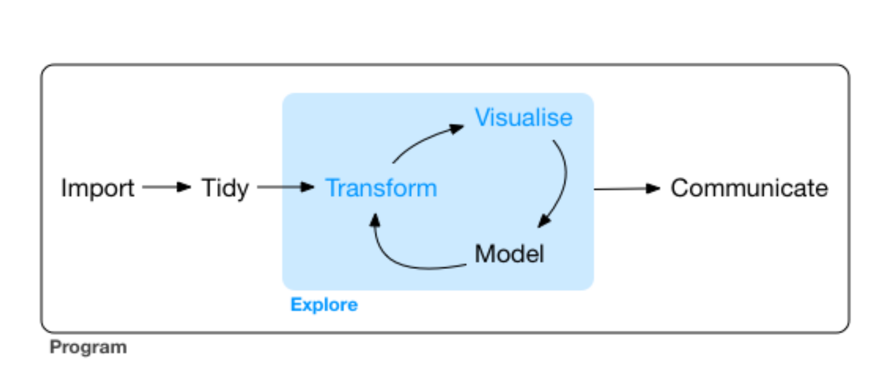

```{r setup, include=FALSE}
# Default knitr options
knitr::opts_chunk$set(
  digits = 2, 
  fig.width = 3, 
  fig.height = 3,
  out.extra = 'style="background-color: transparent;"'
  )
```


```{r pkgs, include=FALSE, message=FALSE}
library(PAGES)
library(ggplot2)
library(dplyr)
library(readr)
```


```{r theme, include=FALSE, message=FALSE}
library(thematic)
thematic_on(bg = "transparent", fg = "black", accent = NA)
theme_set(theme_classic())
```


## The road to becoming a data scientist {.centered}


```{r roadmap, echo=FALSE, out.width="50%"}

```


## Course layout

  
1. Data (geo)science project      

2. Exploring your data    

3. Modelling   

4. Wrangling    

**Each section:**    
5--10 minutes of introduction    
5--10 minutes of live coding and questions    


## PAGES R package

``` r
> # Install PAGES from GitHub:
> # install.packages("devtools") 
> devtools::install_github("MartinSchobben/PAGES", build_vignettes = TRUE)
```
- webpage: https://martinschobben.github.io/PAGES/index.html  
- github repo: https://github.com/MartinSchobben/PAGES


## R for Data Science (R4DS) {.columns-2}


This class is completely based on Hadley Wickham's and Garrett Grolemund's R4DS.

I have augmented the examples with cases from geology.

<p class="forceBreak"></p>


```{r cover, echo=FALSE}
knitr::include_graphics("figures/cover.png")
```


<div style="text-align:right">
<font size="5">
@Wickham2016
</font>
</div>


## Tidyverse


The tidyverse universe: opinionated collection of R packages designed for data science


```{r tidyverse, echo=FALSE}
knitr::include_graphics("figures/tidyverse.png")
```

- **ggplot2**: A modular graphing tool for custom solutions
- **dplyr**: Getting data into the right format
- **readr**: Opinionated import tools for rectangular data.
- **tidyr**: Cast data into a consistent tidy format


<div class="notes">

ggplot2: 
 - It is modular, so you can mix and combine components to get a unique solution to your unique data exploration queries
 - It automatically draws legends (scaling: a function and its inverse)
 - It has carefully selected default settings
 - It is iterative (explore step-by-step)
 - It can perform statistical transformations on the data
dplyr:
 - Manipulating the data
 - New variables
 - Summaries
 - Filter or reorder observations
readr:
 - Read plain-text rectangular files into R
tidyr:
 - Casting data into the tidy format

</div>

## The datasets

- In stratigraphy we look at variations in the value of a variable through time (or time series).   
- The time unit is measured in height or depth, and can sometimes be calibrated for absolute time (age model).   
 
- R package `PAGE` contains the lazy load data: `bonenburg` (geochemistry) and `kuhjoch` (palynology).

<div class="columns-2">

```{r publication, out.width="80%", echo=FALSE}

```

<p class="forceBreak"></p>

```{r bonbenburg, out.width="80%", echo=FALSE}
knitr::include_graphics("figures/bonenburg.png")
```

</div>

<div class="notes">

The bonenburg site has this nice divisions 3 clearly recognisable lithological units.

</div>


## Data (geo)science project {.centered}


```{r prjct, echo=FALSE, out.width="75%"}

```


<div style="text-align:right">
<font size="5">
@Wickham2016
</font>
</div>


## Data (geo)science project


1) Beginner: Emphasis on R objects and output
2) Expert: Emphasis on scripts and functions

RStudio projects

```{r rstudio, echo=FALSE, out.width="33%"}
knitr::include_graphics("figures/rstudio-project-1.png")

knitr::include_graphics("figures/rstudio-project-3.png")
```

<div class="notes">

At some point you are more interested in the script that generated your figure than that you are interested in the figure it self. Then it is time to collect your data science project in own distinct environment.
No more need for absolute pathways, only relative pathways with the project as the lowest directory

Rstudio has many more benefits
- auto-completion of code in scripts and console (with drop down menu)
- panels with environment objects and installed packages

</div>


## Reproducible workflows

1) A clear directory and file structure with meta-data to describe data. Raw data should be read-only and backed-up.

2) R script with a clear documentation of all steps involved.

3) Publish all aspects of this workflow along with your paper.


```{r structure, echo = FALSE, out.width = "50%"}
knitr::include_graphics("figures/project-structure.png")
knitr::include_graphics("figures/permissions.png")
```


<div class="notes">

Step 2 is the subject of the remainder of the course. 

</div>


## Pipes 

**Pipe:** `%>%`

- intermediate steps

``` r
kuhjoch_grps <- group_by(kuhjoch_long, type)
kuhjoch_ad <- mutate(kuhjoch_grps, count + 1)
```


- function composition

``` r
kuhjoch_ad <- mutate(group_by(kuhjoch_long, type), count + 1)
```


- pipe

``` r
kuhjoch_ad <- group_by(kuhjoch_long, type) %>%
  mutate(count + 1)
```

<div class="notes">

Intermediate steps: many objects clutter your environment and you need new names for every object.     
Function composition: hard to read---from the inside to the outside. Easy to forget a bracket.      
Pipe: logical when reading the sequence is also sequence of execution.    

</div>

# Break 1

# Exploratory data analyses 

## Exploratory data analyses {.centered}


```{r eda, echo=FALSE, out.width="75%"}

```


<div style="text-align:right">
<font size="5">
@Wickham2016
</font>
</div>


## Grammar of graphics

“The simple graph has brought more information to the data analyst’s mind than any other device.” — John Tukey

</br>
</br>

<div class="columns-2">


```{r ggplot2, echo=FALSE, out.width="40%"}
knitr::include_graphics("figures/ggplot2.png")
```


<p class="forceBreak"></p>

``` r
ggplot(data = <DATA>) + 
  <GEOM_FUNCTION>(
     mapping = aes(<MAPPINGS>),
     stat = <STAT>, 
     position = <POSITION>,
     orientation = <ORIENTATION>
  ) +
  <FACET_FUNCTION>
```
Grammar of graphics [@Wilkinson2005]

</div>


<div class="notes">

Together, the data, mappings, geom, stat and position form a layer.
The facets are a sub-setting or splitting of the data to highlight certain aspects of the data.
The latter is useful for geochemical multi-proxy studies or count datasets.

</div>


## Aesthetics mapping

Scatterplot: maps each observation to a **horizontal** and **vertical** position and the `geom` represents this as a point 


```{r aes}
ggplot(data = bonenburg) +
  geom_point(mapping = aes(x = del13Ctoc, y = height)) 
```


<div class="notes">

Variation: the tendency of values to change from measurement to measurement.
An ad-hoc hypothesis is that del13C reflect on changes in the C cycle through time.
The aesthetics function maps your data to a visual property of the objects in your plot.
ggplot::aes() can be mapped to a variable or a constant.
We can now look at variation in del13C through time which we often tend to link to temporal change sin the carbon cycle.
But, of course, we know that this is a simplistic view and proxies can be biased due to diagenesis and compositional changes.

</div>


## Aesthetics mapping {data-background="figures/bonenburg.png"}


<div class="notes">

Remember that the stratigraphy of Bonenburg clearly displays a subdivision into three major units.

</div>


## Aesthetics mapping


The colour, shape and linetype can also be used to map additional variables. Here I use the stratigraphy (categorical) as an additional variable.


```{r color, fig.width=5}
ggplot(data = bonenburg) +
  geom_point(mapping = aes(x = del13Ctoc, y = height, colour = strat))
```


<div class="notes">

The stratigraphy is a ordered categorical value.
ggplot2 will automatically assign a unique level of the aesthetic (here a unique colour) to each unique value of the variable, a process known as scaling. 
ggplot2 will also add a legend that explains which levels correspond to which values.

</div>


## Statistical transformations and facets


Internal (statistical) transformation of `<DATA>`.

``` r
ggplot(data = <DATA>) + 
  <GEOM_FUNCTION>(
    mapping = aes(<MAPPINGS>),
    stat = <STAT>,
    position = <POSITION>,
    orientation = <ORIENTATION>
    ) +
  <FACET_FUNCTION>
```

## Visualizing distributions 


<div style="float: left; width: 40%;">

**Typical questions**  

1. Which values are common?  
2. Which values are rare?   
3. And can we discern patterns in the previous examples?   

</div>

<div style="float: right; width: 60%;">


```{r boxplot, echo=FALSE, out.width="100%"}
knitr::include_graphics("figures/EDA-boxplot.png")
```

<div style="text-align:right">
<font size="5">
@Wickham2016
</font>
</div>

</div>

<div class="notes">

In the following example, I will use a bivariate comparison of a continuous and a categorical variable.
Hence, I will use a boxplot to compare several distributions.

</div>


## Visualizing distributions


```{r cov, fig.width=5}
ggplot(data = bonenburg) + 
  geom_boxplot(mapping = aes(y = strat, x = del13Ctoc), stat = "boxplot")
```


<div class="notes">

- The geom geom_boxplot() does a statistical transformation of the continuous variable del13Ctoc.    
- It does this with the argument `stat` which is set to `"boxplot"`.     
- But this is default behaviour, so you do not have to supply it explicitly.  

</div>


## Visualizing distributions


```{r ordered, fig.width=5}
ggplot(data = bonenburg) +
  geom_boxplot(mapping = aes(y = reorder(strat, height), x = del13Ctoc))
```

<div class="notes">
note that here I have also added a scale transformation in the mapping argument which reorder the categorical variable to height. ANd as such following the stratigraphic principles again. Only ever apply simple function in this way
</div>


## Facets


The facets splits data according to a categorical variable.   


```{r strat, fig.width=10}
ggplot(data = bonenburg_long) +
  geom_point(mapping = aes(x = value, y = height)) +
  facet_grid(cols = vars(measurement), scales = "free_x") 
```


<div class="notes">

Useful for the multi-proxy stratigraphic study!    
Note, however, that I have transformed the dataset into a long format data frame.      
I will explain this concept later-on.

</div>


# Break 2

# Patterns and models

## Patterns and models

- Discern patterns (or signals) from noise.

- Exploration, not confirmation or formal inference!


```{r model, echo=FALSE, out.width="70%"}
knitr::include_graphics("figures/data-science-model.png")
```


<div style="text-align:right">
<font size="5">
@Wickham2016
</font>
</div>


## Co-variation continuous--continuous


```{r cross1, fig.width=9, fig.height=4, message=FALSE}
ggplot(data = bonenburg_cross, mapping = aes(x = value, y = del13Ctoc)) +
  geom_point(aes(colour = strat)) +
  facet_wrap(facets = vars(measurement), scales = "free") 
```


## Co-variation continuous-continuous


```{r cross2, fig.width=9, fig.height=4, message=FALSE}
ggplot(data = bonenburg_cross, mapping = aes(x = value, y = del13Ctoc)) +
  geom_point(aes(colour = strat)) +
  geom_smooth() +
  facet_wrap(facets = vars(measurement), scales = "free") 
```


## Transforming variables {.columns-2}


```{r lm, message=FALSE, fig.height=2, fig.width=4}
ggplot(
  bonenburg, 
  aes(x = TOCcfb, y = del13Ctoc)
  ) +
  geom_point(aes(colour = strat)) +
  geom_smooth(method = "lm") 
```


``` r
lm(del13Ctoc ~ TOCcfb, bonenburg)
```

<p class="forceBreak"></p>


```{r loglm, message=FALSE, fig.height=2, fig.width=4}
ggplot(
  bonenburg, 
  aes(x = log(TOCcfb), y = del13Ctoc)
  ) +
  geom_point(aes(colour = strat)) +
  geom_smooth(method = "lm") 
```


``` r
lm(del13Ctoc ~ log(TOCcfb), bonenburg)
```

## Regression models


This was a very simple, exploratory analysis of the data.

Fitting models:

- additive components and interactions (multivariate regression)
- residual diagnostics to validate the assumptions of the model
- correlation structure (time series have a correlation between time steps)
- grouping structure (mixed effect models)
 
Further reading:   

- Peter Dalgaard 2008 *Introduction to statistics with R*   
- John Fox & Sanford Weisberg 2018 *An R companion to applied regression*   
- Alain Zuur  et al. 2008 *Mixed Effects Models and Extensions in Ecology with R*  


---
nocite: | 
  @Dalgaard2008; @Fox2018; @Zuur2008; @Schobben2019
...


# Break 3

# Wrangling

## Wrangling {.centered}


```{r wrangle, echo=FALSE, out.width="75%"}
knitr::include_graphics("figures/data-science-wrangle.png")
```


<div style="text-align:right">
<font size="5">
@Wickham2016
</font>
</div>


## Reading and writing data


<div style="float:  right; width: 20%;">
```{r readr, echo=FALSE, out.width="100%"}
knitr::include_graphics("figures/readr.png")
```
</div>

Load your data into R with `readr` package

- `read_csv()`: comma separated (CSV) files
- `read_tsv()`: tab separated files
- `read_delim()`: general delimited files

Description on website: "In many cases, these functions will just work"!

Reversely, you can also write back to several file formats with `write_*`

<div class="notes">

- Flat files into data frames.    
- First line of the data for the column names.    
- readr uses a heuristic to figure out the type of each column: it reads the first 1000 rows.    
- Compare with base:     
  - Typically much faster (~10x) than their base equivalents       
  - Don’t convert character vectors to factors     
  - They are more reproducible     
  
</div>


## Reading and writing data


```{r example, message=FALSE}
PAGES_example()
read_csv(PAGES_example("bonenburg_raw.csv"))
```

## Tidy data

There are three interrelated rules which make a dataset tidy:

<div class="columns-2">


```{r tidyr, echo=FALSE, out.width="40%"}
knitr::include_graphics("figures/tidyr.png")
```

<p class="forceBreak"></p>


 - Each variable must have its own column.
 - Each observation must have its own row.
 - Each value must have its own cell.


```{r tidydata, echo=FALSE, out.width="40%"}
knitr::include_graphics("figures/tidy.png")
```

</div>


## Long and wide format {.centered}


```{r pivot, out.width="70%", echo = FALSE}

```


## Transforming


Create, rename, reorder variable and summarise with tidyverse `dplyr`.

<div class="columns-2">


```{r dplyr, echo=FALSE, out.width="40%"}
knitr::include_graphics("figures/dplyr.png")
```


<p class="forceBreak"></p>


- `mutate()` e.g., K/Al from K and Al
- `select()` e.g., pick height and K/Al 
- `filter()` e.g., all observations above 3 meters
- `summarise()` e.g., combined with `group_by()` calculate mean value of K/Al for lithological units
- `arrange()` e.g., arrange ascending with height


**grouping**: `group_by()` or `rowwise()`

</div>

<div class="notes">

mutate - adds new variables that are functions of existing variables.     
select - picks variables based on their names.           
filter - picks cases based on their values.          
arrange - changes the ordering of the rows.        

</div>


## Transforming variables

XRF oxides and normalization with elemental ratios


```{r oxides, eval=FALSE}
mutate(
  bonenburg_tidy,
  # oxide correction
  Al_pc = Al2O3_pc * with(marelac::atomicweight, 2 * Al / (2 * Al + 3 * O)),
  Na_pc = Na2O_pc * with(marelac::atomicweight, Na / (Na + 2 * O)),
  K_pc = K2O_pc * with(marelac::atomicweight, K / (K + 2 * O)),
  .keep = "unused"
  ) %>%
  # normalization with Al and rename
  mutate(
    across(c(Na_pc, K_pc), ~.x / Al_pc, .names = "{gsub(\"pc\", \"\", .col)}Al"),
    .keep = "unused"
    )
```


# Break 4

## Recap

**Steps of a data (geo)science project:**     

1) Create an RProject and organised file structure     
2) Load your data with `readr`      
3) Wrangle:     
    - Tidy your data with `tidyr`     
    - Create new variables, rename and reorder with `dplyr`    
4) Visualize data with `ggplot2`      
5) Model and observe patterns with `ggplot2` and other tools     
6) Reiterate steps 3--5   
7) Publish or present results along with documentation of intermediate steps

## PAGES package

**Data**   
lazy load data: `bonenburg` and `kuhjoch` as well as the long formats: `bonenburg_long` and `kuhjoch_long`   

**Raw data**   
`PAGES_example()`   

**Examples**   
- project:  `vignette("project", package = "PAGES)`   
- explore:  `vignette("explore", package = "PAGES)`   
- model:  `vignette("model", package = "PAGES)`   
- wrangle:  `vignette("wrangle", package = "PAGES)`    

**Slides**   
`render_slides()`  


## References {.smaller}

