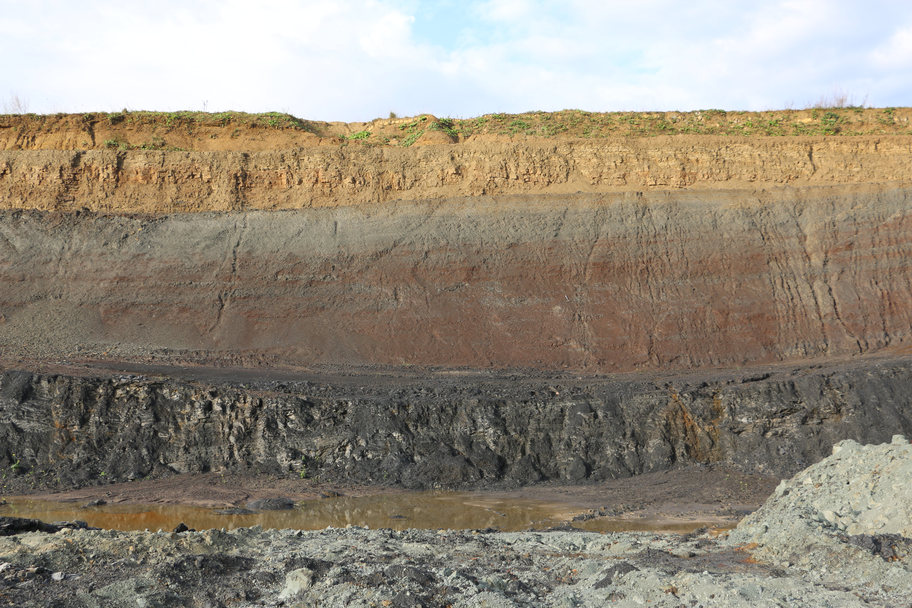

```{r, include = FALSE}
knitr::opts_chunk$set(
  collapse = TRUE,
  comment = "#>"
)
```

```{r setup}
library(PAGES)
```


# Tidyverse packages

In the following exercise I will use the packages `ggplot2` [@ggplot2; @ggplot22016] for plotting and `dplyr` [@dplyr] for data manipulations. Both packages are from the **tidyverse** collection.


```{r extra}
library(ggplot2)
library(dplyr, warn.conflicts = FALSE)
```


# Data

I will use for this example the palynological dataset of my 2019 study on the Triassic-Jurassic transition [@Schobben2019].

```{r bonenburg,echo=FALSE, out.width="50%"}

```

# Position and orientation

In this example, I will show how the options `position` and `orientation` of th `geom_area()` function is important for stratigraphic studies with palynological count data.

The following is listed in the manual for these arguments.

- position---Position adjustment, either as a string, or the result of a call to a position adjustment function.
- orientation---The orientation of the layer. The default (`NA`) automatically determines the orientation from the aesthetic mapping. In the rare event that this fails it can be given explicitly by setting `orientation` to either `"x"` or `"y"`. See the **Orientation** section for more detail.


You will notice that the long format data (`kuhjoch_long`) is not the format of data table that you are normally used to. I will later on explain the transformation needed to obtain this type of data from the customary wide format data frame. The values of the variable `count` are absolute counts of the micro-floral element under the microscope. In the exercise I will transform this to relative counts, i.e., a "closed sum".

First, I split the dataset into two types of analyses with `facet_grid()` and the categorical value `type` supplied to the argument `cols` with the function `vars()`. Furthermore, I supply `"y"` to the argument `orientation` of `geom_area()` to ensure the correct aesthetics mapping according to stratigraphy. I keep the argument `position` on the default setting `"identity"`.

```{r aboslute, fig.width=7}
ggplot(data = kuhjoch_long, mapping = aes(x = count, y = Height,  fill = label)) + 
  geom_area(position = "identity", orientation = "y") +
  facet_grid(cols = vars(type))
```

This produces a stratigraphic plot with absolute palynomorph counts.

## Transformation and position

The previous plot is not very custom for palynology and we rather use relative counts to get a sense of compositional changes in palynology with height ore depth in a profile or core.

The position adjustments `"fill"` applies transformation to the position of elements within the `geom_area()` call. This stacks the areas but also transforms so that it scales to 1 (or 100%). This is useful behaviour in the instance palynological count data as we now can better see compositional changes; e.g. spores vs. pollen and aquatic vs. terrestrial inputs.


```{r fill, fig.width=7}
ggplot(data = kuhjoch_long, mapping = aes(x = count, y = Height,  fill = label)) + 
  geom_area(position = "fill", orientation = "y") +
  facet_grid(cols = vars(type))
```


# Manual transformation with `dplyr`

To exemplify what happens internally in the previous ggplot call, we can do the transformation outside of the call by applying `group_by()` and `mutate()` of the `dplyr` package. Note the change from the pipe (` %>% `) to the plus sign (`+`) in the ggplot call. The usage of the `dplyr` functions will be explained a little later in the presentation.


```{r manual, fig.width=7}
group_by(kuhjoch_long, Height, type) %>% 
  mutate(count = count / sum(count)) %>% 
  ggplot(mapping = aes(x = count, y = Height,  fill = label)) + 
  geom_area(orientation = "y") +
  facet_grid(cols = vars(type))
```


# References
