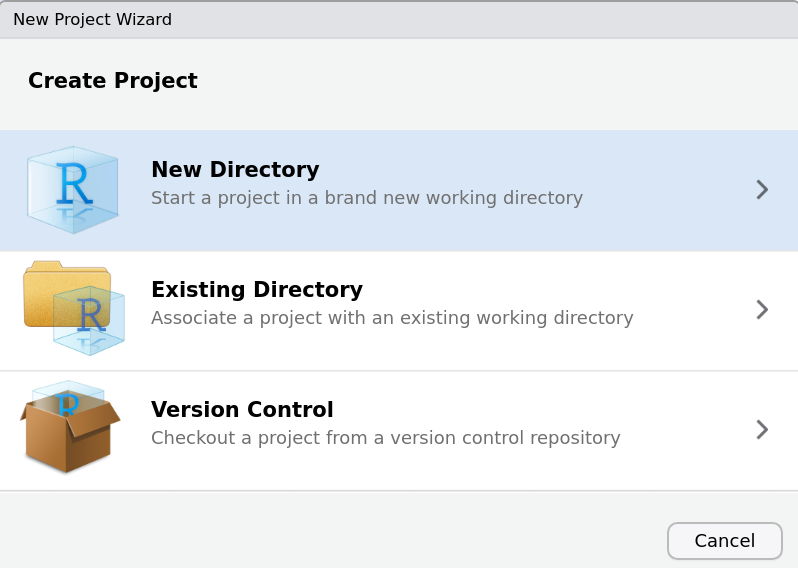
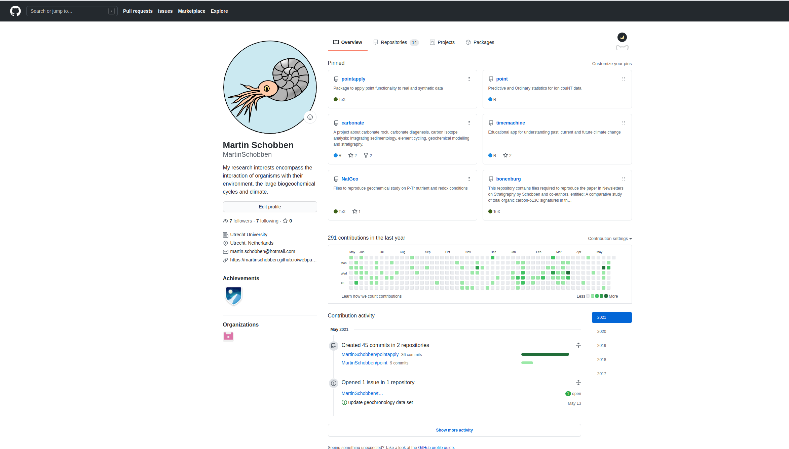

```{r, include = FALSE}
knitr::opts_chunk$set(
  collapse = TRUE,
  comment = "#>"
)
```

```{r setup}
library(PAGES)
```


# RStudio projects

RStudio projects keep all files at one place; scripts, figures datasets. This way you can always find the script that use you used to generate that one particular figure of your manuscript. Secondly, RStudio projects root all files relative to the project directory. For example, saving the figures created in this talk would look like as follows.

``` r
# scatterplot bonenburg 
ggplot(data = bonenburg) +
  geom_point(mapping = aes(x = del13Ctoc, y = Height)) 
# save plot  
ggsave("bonenburg.png")
```

Lastly, RStudio projects are convenient when you quit your analysis at the end of one day. When restarting RStudio on the next day you get right back where you left off.

To create an RStudio project select `File` from the top toolbar and from the drop-down menu select `New Project`. This will initiate a sequence of windows to set up the project. Here, I show the most common options but many more options are available.

Select New Directory to create a new folder.

```{r rstudio1, echo=FALSE, out.width="40%"}

```

Select New Project to create a clean RStudio Project.

```{r rstudio2, echo=FALSE, out.width="40%"}
knitr::include_graphics("figures/rstudio-project-2.png")
```

Name the New Project. I used here `PAGES`.

```{r rstudio3, echo=FALSE, out.width="40%"}
knitr::include_graphics("figures/rstudio-project-3.png")
```


# Data Management

After creating a RStudio project, I advice setting up an ordered file structure. Which has as a minimum the following components:

- A `raw-data` directory containing the unprocessed data and make these data files `read-only`.
- A `data` directory containing processed data.
- An `R` directory containing the R scripts.


```{r out.width="40%", echo=FALSE}
knitr::include_graphics("figures/project-structure.png")
```

To change the permission of files in linux ubuntu/mint select the following by right clicking on the file.

```{r out.width="40%", echo=FALSE}
knitr::include_graphics("figures/permissions.png")
```

For windows 10 check: https://windowsreport.com/folder-reverting-to-read-only/#1

Keep back-ups of the raw data directories as a minimum but preferably the whole directory. Accidents are bound to happen, so to not jeopardize a time intensive and expensive research project, the previous recommendations are good practice to prevent future sorrow. Besides back-ups on external hard-drives, universities and research institutes provide cloud services to sync and back-up materials. Otherwise commercial options are available, such as [SpiderOak](https://spideroak.com/one/)^TM^.


## Version control


Experienced users will use version control, such as Git and Github, to keep track of the changes in their scripts over time. Rstudio project also integrate this option in its interface.

This is my github frontpage, where I have several repositories containing a remote back-up of my scripts and the complete history with version control.


```{r out.width="80%", echo=FALSE}

```


